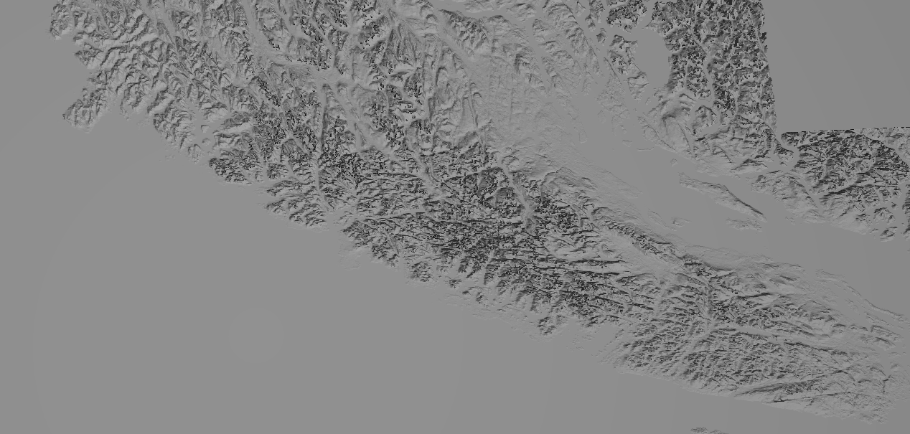

## Get some data
download GEOTIFF files from here: https://earthexplorer.usgs.gov/

or pull a folder of vancouver island here: https://drive.google.com/file/d/1_2pQtuB1SNa2lZYEqgYDIcwSGux4143R/view?usp=sharing

the files should be in a data folder, i.e. `./data/*.tif`

## Install dependencies
```bash
make install   # to install dependencies
pip install .  # to install python packages
```

## Testing
- run `./main.py` to generate two stl files (golden hinde and vancouver island)
- view STLs here: https://www.viewstl.com/
- it should render something like this:
- 